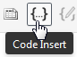

# Style Guide

## Language

* :us: Your article should be written in US English.
* :speech_balloon: Do not use overly complex words and sentences. We are an international company, with an international audience, all with varying levels of English mastery. We respect that and write clearly. Simple writing can be powerful and beautiful. Divide long sentences into shorter ones. Everyone (with at least a basic understanding of English) should be able to get a grasp of your explanations.
* :dart: Our audience is busy. Long introductions may be good for books or other creative writing, but not for our technical audience. That doesn’t mean that we only write short things. Long articles/posts/books could be great, but long introductions and long transitions between paragraphs are not. 

## Tone and Narration

* :blush: The tone of the article should be friendly. You are not a strict mentor but rather a person who helps his/her colleagues to better understand a given topic. Adding a couple of appropriate jokes is okay too. On the other hand, don't get *too* informal:
  + :heavy_check_mark: The explanations should be confident, precise, clear, comprehensive, and fun.
  + :x: The explanations should not be overly pedantic, complicated, or patronising.
* :family: In your explanations use words like "we" and "us" when appropriate (not "I" and "me"). You are solving the given task together with the reader:
  + :heavy_check_mark: Next *we* are going to install the following software...
  + :x: Next *I* am going to install the following software...
* :point_right: Address the reader with the word "you":
  + :heavy_check_mark: I hope *you* found this article helpful and interesting!
  + :x: I hope *readers* found this article helpful and interesting!
* :link: Explain complex terms. Provide links to relevant materials if needed.
* :arrow_right_hook: Use transition words: "first", "next", "lastly", "therefore", "so", and other.
* :no_mouth: Do not use slang and other inappropriate words (like swearing). "That dog won’t hunt" means "that’s not going to work" and unless you are in the American South, you probably won’t know that. Let’s avoid turns of phrase that are regional specific.
* :peace_symbol: Do not attack any groups of people or start holy wars ("Linux is better/worse than Windows").
* :speech_balloon: Do not use too many passive voice. In active voice, the subject of the sentence does the action. In passive voice, the subject of the sentence has the action done to it. Words like "was" and "by" may indicate that you’re writing in passive voice.
  + :heavy_check_mark: You should install the following software...
  + :x: The following software should be installed...
* :black_nib: Use -ing sparingly. "I was thinking" is not as strong and active as "I think". Remove -ing wherever possible.
* :woman: :man: Try to use gender-neutral phrases. Unless we are talking about a specific person and we know their gender preferences, that is.
* :no_good: We don’t use our marketing channels to spread rumors or falsehoods about our competitors. We don’t celebrate publicly when they fail. We do compete and we compete hard. We strive to win business and convert prospects but we do so with respect and within the bounds of the law.

## Grammar and Spelling

* :ballot_box_with_check: Do not forget to proofread the text (though the editor will double-check everything and make edits as necessary). You may use [grammarly.com](https://www.grammarly.com/) or a similar tool.
* Capitalize company names according to the company’s style.
* Use [Oxford comma](https://www.grammarly.com/blog/what-is-the-oxford-comma-and-why-do-people-care-so-much-about-it/):
  + :heavy_check_mark: Lock, stock, and two smoking barrels
  + :x: Lock, stock and two smoking barrels
* [Use dashes and hyphens properly](https://www.grammarly.com/blog/hyphens-and-dashes/).

## Sections and Subsections

* Give your article a logical structure by dividing it into sections and subsections (subtitles), for example:
  + Introduction
  + Prerequisites
  + Setting Up Sample Application
  + Explaining Feature A
  + Explaining Feature B
  + Conclusion
* The title of the article will be a heading level 1 (`h1`) which means that sections of the article should be `h2`-`h6`.
* Subtitles should not be longer than 5-6 words.
* The title as well as subtitles should be properly capitalized. To achieve that, navigate to [capitalizemytitle.com](https://capitalizemytitle.com/), choose "sentence case" option, paste your title in the text box, and it will be capitalized for you. 

### Bullets

Bullets is a great tool but don't forget to format them properly:

* Try to add an introductory sentence followed by a colon.
* Use a period after every bullet point that is a complete sentence.
* Use no punctuation after bullets that are not complete sentences.
* Capitalize the first letter of every bullet point that is a complete sentence.
* Do not capitalize the first letter of bullets that are not complete sentences.
* Use either complete sentences or fragments.

### Links

* Avoid using phrases like "Click here" for a link. Try using more meaningful text:
  + :heavy_check_mark: Documentation for this method [can be found on the official website](http://example.com/)
  + :x: [Click here](http://example.com/) to find documentation for this method
* :link: Provide links to relevant resources (documentation, specifications) when explaining new terms and concepts.
* :mega: Giving links to other Lokalise articles is very much appreciated.
* On the other hand, do not overuse external links: for example, do not provide references for common knowledge. The provided links should be relevant to the main topic of the article.
* :heavy_exclamation_mark: Never ever add sponsored or promotional links without agreeing with the editor. Such links will be removed.

### Other Tips

* *Acronyms* should be explained unless they are well-known (like HTML or PNG).
* :speech_balloon: *Citations* should include the original sources.
* :framed_picture: If you are using *images* from other sources, make sure you have permission to do so. We encourage authors to use original images.
* Provide `alt` text for your images.
* :shipit: Do not use *smiles* and *emoticons*. There is a difference between how we communicate with friends and how we communicate with our prospects and customers. Generally, we don’t use emojis on our website or blog. We use them at times in social posts, emails and Intercom chats. Memes are also something we rarely share outside of Lokalise. If we use them we educate ourselves on the ones that have negative meaning.
* :confused: Humor is hard to do in such a way that it scales internationally. Like emojis it can be used to accentuate and draw attention but should not be overused. Being serious does not mean we are mean, sharp-edged, unpleasant or distasteful. It does mean we are direct.
* Do not use numbers to specify the count:
  + :heavy_check_mark: We have added support for *two* languages...
  + :heavy_check_mark: There are *ten* users...
  + :x: We have added support for *2* languages...
  + :x: There are *10* users...
* Avoid using *complex contractions* like "could've":
  + :heavy_check_mark: We'll, isn't, hasn't, could have, would have
  + :x: Could've, should've, would've
* :exclamation: The name of our company is *Lokalise*. Not Localise, Localize, or Lokalize.

## Code Samples

### Inline Code

* Inline code [should be formatted with backticks](https://confluence.atlassian.com/bitbucketserver/markdown-syntax-guide-776639995.html#Markdownsyntaxguide-Inlinecodecharacters).
* All variables, functions, methods, classes, filenames, directory names, accepted values, returned values, and similar constructs should be formatted as inline code when mentioned in the text:
  + "The function is `hello()`. It lives in the `Demo` class and return `"Hello"` as a result. The `Demo` class is defined in the `lib/demo` file."

### Code Blocks

* :page_facing_up: Large code blocks should be presented with GitHub Gist, CodePen, or similar services. We also have a Highlighter plugin for WordPress installed (see below). 
* You may utilize the built-in highlighter tool by pressing the Code Insert icon. This tool has a limited set of supported languages but in general it works fine.

  + Highlighter allows to point out specific lines. To achieve that, press on the settings icon after inserting your code and edit the "Point out lines" option

* Indent and format your code properly making it easier to read.
* Make sure the code does not contain any errors or typos.
* :tophat: :rabbit: Try not to use obscure techniques (aka "black magic"). If you must, explain this technique to the reader.
* :scream_cat: If you are building a complex feature try to move step-by-step gradually increasing complexity. Do not throw a huge code sample at the reader trying to explain everything in one go.
* If the code sample has multiple important lines, mark them in the code with the comments and then explain each line separately. For example:

```ruby
a = 1     # 1
call_irrelevant_method()
b = a * 2 # 2
other_method()
c = a - b # 3
```

1. Variable `a` is assigned with a value of `1`.
2. Variable `b` equals to the value of `a` multiplied by `2`.
3. Variable `c` equals to `a` minus `b`.

[< Previous](01-general-requirements.md) | [Next >](03-collaborating-with-editor.md)
