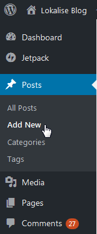
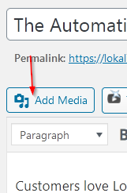
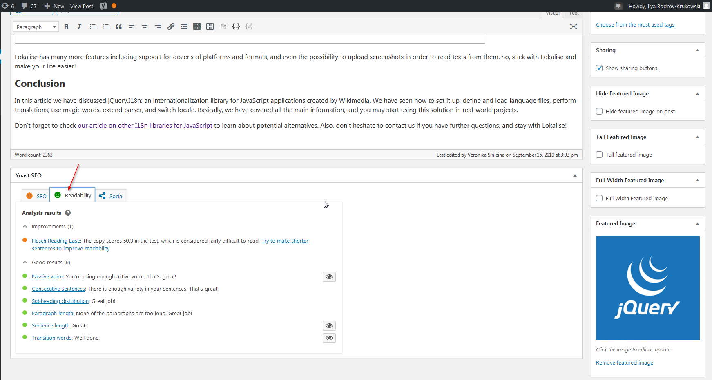
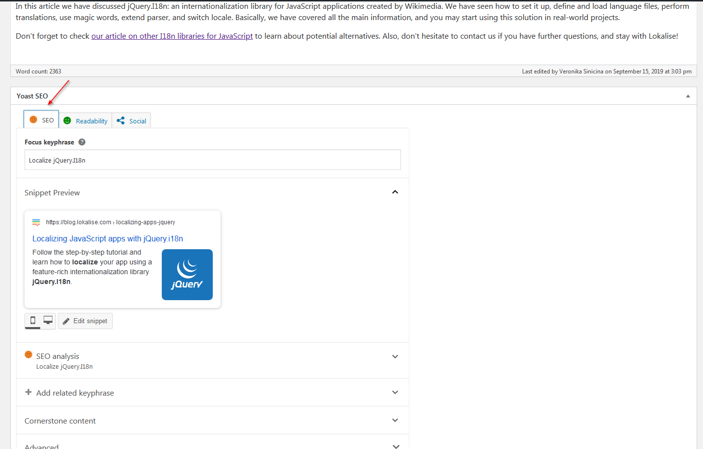

# Writing Your Article

## Creating a New Article

:black_nib: The articles are written in our WordPress CMS. You will be provided with all the necessary login information by your editor.

After logging in, click *Posts* > *Add New* in the main menu:



Next, give your post a title and proceed to writing. :star2:

**Note that the article has to be saved as a draft!**

## Markdown

If you prefer to write in Markdown format using your favourite editor — that's okay as well. Once your article is finished, log into our WordPress and import Markdown file using the Markdown plugin as [instructed in this small video](https://www.youtube.com/watch?v=3EhQ4Xjzg6s).

*Do not send plain Markdown files to your editor — import them into WordPress!*

## Post Editor

### Adding Table of Contents

To add a table of contents (TOC), simply place the following snippet:

```
[toc]
```

For example:

```
So, let's get our hands dirty and proceed to the main part of the post!

[toc]

As the first step...
```

### Adding Videos

If you need to add a video, press "YouTube" button right above the post editor, and follow the wizard's instructions.

### Adding Images

To add an image into your post, press "Add Media" button above the post editor. You'll then be able to choose an uploaded image from the library, or upload a new one from your PC.



### Readability

:book: Our WordPress has a special plugin installed that will give you some tips regarding article readability. It can be found right under the text editor:



Try to follow the given tips. Of course, it is not mandatory to 100% fulfill all recommendations but some of them are quite important (they were already mentioned above):

* Do not use overly complex words and phrases.
* Do not use too many passive voice.
* Try to use transition words.
* Divide text into sections and subsections.
* Do not write too long paragraphs.

### SEO

:mag: SEO is very important for our blog as well. There's a special plugin that gives basic SEO recommendations. It can be found under the text editor:



Provide focus keyphrase (which should be discussed with the editor) and observe the results. Try to follow the given tips!

[< Previous](03-collaborating-with-editor.md) | [Next >](05-getting-paid.md)
